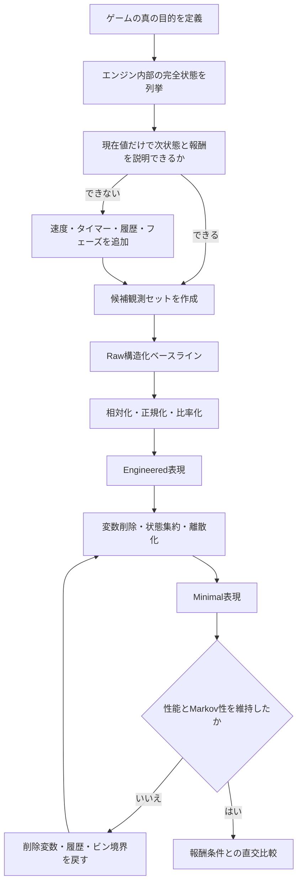
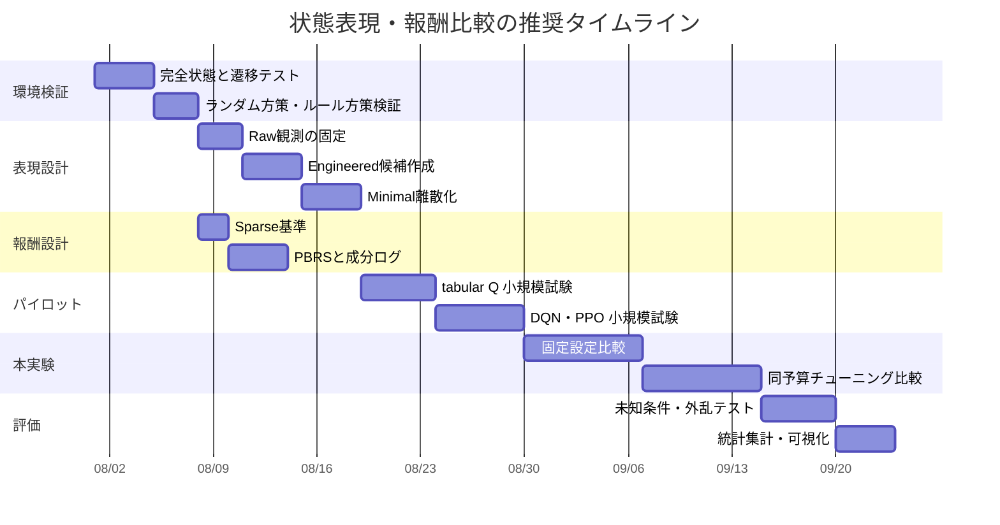

# 自作ゲームを強化学習で学習させるための状態表現・報酬設計ガイド

## エグゼクティブサマリ

自作ゲームの強化学習では、**「素のデータを渡すか、特徴量を作るか」ではなく、意思決定に必要な情報を保ちながら、不要な状態区別をどこまで減らすか**が本質になる。表形式Q学習は有限で離散的な状態行動対を前提とし、全状態・全行動が繰り返し訪問されることなどを条件に最適行動価値へ収束するため、無関係な変数や過度に細かい離散化は理論上の正しさを失わせなくても、実用上の学習時間を急激に増やす。反対に変数を削りすぎると、本来異なる最適行動を持つ状態が同一視され、状態エイリアシングと非マルコフ化が起きる。citeturn10search0turn6view1turn4search3

本レポートの推奨は、最初から画像入力や高度な表現学習へ進むのではなく、まず**完全に近い構造化状態を基準系として動かし、その後にEngineered、Minimalへ段階的に削る**方法である。画像はこの三系列と同列に混ぜず、別の「センサーモダリティ実験」として扱うべきである。画像とベクトルを直接比較すると、状態表現だけでなく、CNN、データ拡張、表現学習、ネットワーク容量などまで同時に変わり、何が性能差を生んだのか分からなくなるためである。DQNは画像から直接方策を学べることを示したが、CURLのような表現学習を追加して初めて、画像ベースのサンプル効率が構造化状態ベースに近づいた事例もある。citeturn1search0turn9search2turn4search10

| 論点 | 推奨判断 |
|---|---|
| 最初の観測 | ゲームエンジン内部の構造化変数を、できるだけ完全な状態として渡す |
| Q学習向け表現 | 最適行動を変える変数だけを残し、意味のある境界で離散化する |
| 特徴量加工 | 絶対座標だけでなく、相対位置、距離、接近速度、比率、位相を候補にする |
| 最小状態 | 「変数数が少ない状態」ではなく、「意思決定に必要十分なマルコフ状態」を目指す |
| 報酬 | 真の目的報酬を固定し、学習補助報酬は別成分としてログする |
| Reward shaping | 可能ならPotential-Based Reward Shapingを使い、元の最適方策を保持する |
| 比較実験 | Raw／Engineered／Minimal × Sparse／Shaped × tabular Q／DQN／PPO |
| 評価 | 学習時の成形報酬ではなく、未加工のタスク達成指標で比較する |
| 画像入力 | 構造化三系列とは別実験にし、フレーム履歴と表現学習の影響を分離する |

重要なのは、**状態表現と報酬を独立に最適化しないこと**である。観測が不十分なら、どれほど密な報酬を与えても同じ観測に対して矛盾した行動を学ぶことになる。一方、観測が十分でも、報酬が目的を正しく表していなければ、エージェントは報酬関数の抜け穴を最適化する。したがって、設計の順序は「タスク定義 → 完全状態 → 観測化 → 報酬 → アルゴリズム」であり、報酬から先に考えない方がよい。Potential-based shapingの理論は、追加報酬が一定の形を満たす場合に元の最適方策を保持できることを示している。citeturn7view0turn1search14

本件で未指定なのは、**ゲームジャンル、行動空間の離散・連続、対戦・単独、完全観測・部分観測、確率的要素、エピソード長、利用エンジン、計算予算**である。そのため、以下では2D移動、探索、戦闘、収集、スロット型意思決定などへ転用できる一般的な設計として示す。

## 問題設定と理論的整理

強化学習で区別すべきなのは、環境内部の**状態 \(x_t\)**、エージェントへ渡す**観測 \(o_t\)**、学習器へ入力する**表現 \(z_t\)**である。

\[
x_t
\;\xrightarrow{\text{観測関数}}\;
o_t
\;\xrightarrow{\text{加工・エンコーダ}}\;
z_t
\;\xrightarrow{\pi\ \text{または}\ Q}\;
a_t
\]

ゲームエンジンが保持する全内部変数が \(x_t\)、画面や公開変数が \(o_t\)、相対距離や離散カテゴリ、CNN潜在表現が \(z_t\) に相当する。Unity ML-Agentsの公式ガイドも、ベクトル観測には最適な判断に必要な変数を含める一方、余分な情報はできるだけ含めないことを推奨している。citeturn10search7

**完全状態**とは、現在の情報と行動が分かれば、次状態と報酬の分布を予測するうえで、それ以前の履歴が追加情報を持たない状態である。

\[
P(x_{t+1},r_t\mid x_t,a_t,x_{t-1},a_{t-1},\ldots)
=
P(x_{t+1},r_t\mid x_t,a_t)
\]

一枚の画像や現在座標だけでは、速度、敵のクールダウン、隠れたフェーズ、直前の行動などが分からないことがあり、その場合はマルコフ決定過程ではなく部分観測問題になる。DRQNは、単一フレームだけを観測する環境でLSTMを使い、時間方向の情報を統合できることを示した。Unityも、時間比較が必要な観測ではスタックまたはRNNを使うよう案内している。citeturn1search1turn10search7

表形式Q学習の更新は次式で表される。

\[
Q(s_t,a_t)
\leftarrow
Q(s_t,a_t)
+
\alpha
\left[
r_t+\gamma\max_aQ(s_{t+1},a)-Q(s_t,a_t)
\right]
\]

WatkinsとDayanの収束結果は、離散的に表現された行動価値について、全状態で全行動が繰り返し標本化されることなどを条件とする。したがって、各変数のビン数が \(b_1,b_2,\ldots,b_d\) なら、最大状態数はおおむね

\[
|S|=\prod_{i=1}^{d}b_i
\]

となり、変数を一つ追加するだけでも、そのビン数に比例してQ表と訪問要求が増える。citeturn10search0turn10search4

ただし、状態数を減らせば常によいわけではない。異なる状態 \(x_i,x_j\) を同じ抽象状態 \(\phi(x_i)=\phi(x_j)\) にまとめるとき、両者で適切な行動や将来報酬が十分近くなければならない。近似状態抽象化の研究は、状態空間を圧縮して計算量を減らせる一方、抽象化の粗さに応じた最適性損失が生じることを理論・実験の両方から示している。citeturn7view1turn0search8

この関係は次のように整理できる。

| 表現 | 主な利点 | 主なリスク | 向いている用途 |
|---|---|---|---|
| 画像・センサー生入力 | 人手で状態変数を定義せず、外観変化を含めて学べる | 高次元、ノイズ、認識と制御の混同、部分観測 | 画面しか取得できない既存ゲーム、視覚汎化 |
| Raw構造化 | 情報欠落が少なく、設計ミスを見つけやすい | 無関係変数、絶対座標依存、状態空間爆発 | 最初のベースライン、環境検証 |
| Engineered | 相対化や物理量により学習を速めやすい | 人間の仮説に依存し、情報を誤って潰す可能性 | 実用エージェント、比較実験 |
| Minimal | Q表が小さく、解釈・デバッグが容易 | 状態エイリアシング、非マルコフ化 | tabular Q、ルール抽出、小規模ゲーム |
| Learned latent | 生入力からタスク関連特徴を自動抽出できる | 学習不安定、評価困難、表現崩壊 | DQN、PPO、画像・大規模観測 |

**「素のデータを渡す」という近年の流れは、主に関数近似器が十分な場合の話であり、表形式Q学習にはそのまま適用できない。** 深層学習では、冗長な連続ベクトルもニューラルネットワークが共有・近似できる可能性があるが、表形式では値が少し違うだけで別状態になる。さらに、深層RLでも無関係な入力が無害とは限らず、状態表現研究は、制御に関係する情報を保ちつつ、背景やノイズなどを捨てることを主要目的としている。citeturn5search12turn9search3turn0search5

状態と報酬のバランスは、次の二つの質問で判断するとよい。

| 確認対象 | 設計質問 |
|---|---|
| 状態の十分性 | 同じ観測に見える二つの状況で、最適行動が変わることはないか |
| 状態の簡潔性 | ある変数を変えても最適行動、報酬、次状態分布が変わらないなら削除できないか |
| 報酬の忠実性 | 報酬を最大化する行動は、本当にゲームで望む行動と一致するか |
| 報酬の学習可能性 | 成功報酬に到達する前に、偶然でも有益な軌跡を発見できるか |
| 状態・報酬の整合 | 報酬差を説明するために必要な情報が観測に含まれているか |

## 研究レビュー

以下は、自作ゲームの状態表現・報酬設計に直接応用しやすい研究を、古典理論、特徴選択、画像表現、報酬成形、自動報酬、実験評価に分けて比較したものである。

| 著者・年 | 手法・論点 | 環境・評価 | 主要結果 | 自作ゲームへの適用範囲 |
|---|---|---|---|---|
| Watkins & Dayan, 1992 | 表形式Q学習の収束 | 有限マルコフ環境 | 全状態行動対の反復標本化などの条件下で、最適Q値への確率1収束を証明 | Minimal表現を設計する際の理論的出発点。連続値をそのままキーにしない citeturn10search0 |
| Ng, Harada & Russell, 1999 | Potential-Based Reward Shaping | MDP、距離・サブゴール型成形 | \(F=\gamma\Phi(s')-\Phi(s)\) 型の追加報酬が最適方策を保持する条件を提示し、非potential型成形の問題を説明 | 距離報酬、進捗報酬、サブゴール報酬を安全寄りに設計する基本理論 citeturn7view0turn1search14 |
| Hachiya & Sugiyama, 2010 | 条件付き相互情報量による特徴選択 | ノイズ変数を含むGridWorld | 状態特徴系列と将来リターンの暗黙依存を評価し、関連特徴を選択 | 候補変数が多い自作環境で、リターン予測に寄与しない変数を調べる citeturn6view2turn7view3 |
| Mnih et al., 2015 | DQNによる画像からのend-to-end制御 | Atari 49ゲーム | ピクセルとスコアから単一の基本構成で多数のゲームを学習 | 画像入力が可能であることの基準。ただし構造化状態より安いという意味ではない citeturn1search0turn1search18 |
| Hausknecht & Stone, 2015 | DRQN、LSTMによる履歴処理 | 通常・点滅Atari | 単一フレーム入力でも履歴を統合し、観測品質変化への耐性を示した | 速度、クールダウン、隠れ状態が現在観測だけで分からないゲーム citeturn1search1turn1search7 |
| Abel, Hershkowitz & Littman, 2016 | 近似状態抽象化 | 複数のMDP | 近似的に似た状態を統合したときの方策損失境界を示し、複雑性低下を実証 | Minimal設計で「圧縮量対性能損失」を考える理論枠組み citeturn6view1turn7view1 |
| Lesort et al., 2018 | State Representation Learning概観 | ロボット・制御 | 低次元性、時間変化、行動影響などを状態表現の重要特性として整理 | 画像・センサーから潜在状態を学ぶ場合の設計分類と評価軸 citeturn5search12turn5search16 |
| Liu et al., 2019 | Object-oriented state abstraction | Battle City | 生画像、オートエンコーダ表現より小さい状態空間を用い、ノイズ・ぼかし下でも高い最終報酬を報告 | オブジェクト座標・種別・関係性へ変換する中間表現。単一ゲームの限定的実証である点には注意 citeturn6view3turn7view5 |
| Zhang et al., 2020 | Deep Bisimulation for Control | 画像ベース連続制御 | 報酬と遷移が近い状態を潜在空間でも近づけ、タスク無関係な視覚差への不変性を狙う | 背景や装飾が変わるゲームで、制御に必要な情報だけを潜在表現へ残す citeturn9search3turn9search7 |
| Laskin, Srinivas & Abbeel, 2020 | CURL、対照学習 | DeepMind Control Suite、Atari | 100Kステップ条件で従来の画像ベース手法を上回り、状態特徴を使う手法に近い効率を報告 | ピクセル入力を使う場合の強い基準。画像拡張と補助表現学習の効果を分離して検証する必要がある citeturn9search2turn9search6 |
| Allen et al., 2021 | Markov state abstraction学習 | オンライン・オフラインRL | 逆モデルと時間的対照学習を組み合わせ、抽象表現がマルコフ性を満たすための十分条件を提示 | 自動エンコーダが履歴依存を残していないかを考える理論的根拠 citeturn0search25 |
| Hao et al., 2021 | 疎な特徴選択とサンプル効率 | 高次元batch RL | 候補特徴が多い場合に、疎性を利用した特徴選択が統計的効率を改善し得ることを解析 | 多数のゲーム内部変数から少数の有効特徴を選ぶ場合。主に線形・オフライン設定 citeturn4search23 |
| Westphal, Hailes & Musolesi, 2024 | Transfer Entropy Redundancy Criterion | tabular Q、Actor-Critic、PPO、複数環境 | 行動へ情報を移さない状態変数を除外し、複数アルゴリズムで学習高速化を報告 | RawとMinimalの中間をデータ駆動で決める比較実験に近い。arXivプレプリント citeturn4search3 |
| Yuan et al., 2023 | 自動内発的報酬成形 | MiniGrid、画像制御 | 探索を促進する内発報酬を自動調整し、疎報酬環境での探索改善を検討 | ゴール発見が極めて難しい探索ゲーム。ただし真のタスク報酬との比率調整が必要 citeturn0search2 |
| Zhang, Stadie & Ba, 2020 | 二段階最適化による内発報酬学習 | RLベンチマーク | 方策を内側、外部目的性能を外側とするbilevel optimizationとして報酬学習を定式化 | 手作業の補助報酬を減らす研究方向。ただし実装・計算コストは大きい citeturn8search7 |
| Ma et al., 2024 | EUREKA、LLMによる報酬コード生成 | 多様なロボット制御タスク | LLMが候補報酬コードを生成し、学習フィードバックを使って反復改善。報告上、人間設計を多数のタスクで上回った | 物理量が明示されたシミュレータでの報酬探索に有効。ゲーム全般への無条件な一般化は未検証 citeturn8search2turn8search10 |
| Henderson et al., 2018 | 深層RLの再現性 | 複数の連続制御ベンチマーク | 初期値、ネットワーク、実装差、乱数による変動を示し、標準化された報告を提唱 | Raw／Engineered／Minimal比較で、同じハイパーパラメータ・複数seedを使う根拠 citeturn9search4turn9search12 |
| Agarwal et al., 2021 | 少数run時の統計評価 | Atari、Procgen、Control Suite | 平均・中央値だけでは結論が変わり得るとして、区間推定、IQM、performance profileを推奨 | 比較実験では平均最終報酬だけで優劣を決めない citeturn9search1turn9search9 |

研究全体から得られる一貫した結論は、**よい表現とは、入力を忠実に再構成する表現ではなく、報酬と制御可能な遷移を予測するために必要な区別を保持する表現**だということである。画像の背景色が異なっても、得られる報酬と行動後の力学が同じなら統合した方がよい。一方、見た目がほぼ同じでも、敵の攻撃準備状態や速度が違い最適行動が変わるなら分離しなければならない。Bisimulation系研究はこの直感を形式化しているが、有限データやオフラインデータでは推定が不安定になり得ることも指摘されている。citeturn9search11turn0search9

したがって、実務的には**人手設計か自動学習かの二択ではない**。最も再現性が高い進め方は、完全な構造化状態でタスク自体が解けることを確認し、人手による相対化・集約を試し、その後に特徴選択や潜在表現学習で置き換える段階設計である。Preferred Networksの実践解説も、状態表現学習を高次元入力から制御に有用な低次元表現を得て、試行回数を抑える方向として説明している。citeturn5search8turn5search12

## 自作ゲーム向け実践ガイド

**状態変数設計フロー**



このフローは、Unityの「最適判断に必要な変数を含め、余分な情報を避ける」という原則、近似状態抽象化、情報理論的特徴選択を実装工程へ翻訳したものである。citeturn10search7turn7view1turn4search3

**候補変数の生成**

最初は削ることを考えず、ゲーム内部状態を次の役割ごとに列挙する。

| 分類 | 代表例 | 注意点 |
|---|---|---|
| 自己状態 | 座標、速度、向き、HP、スタミナ、所持数 | 座標だけでは慣性を表せない場合がある |
| 他者状態 | 敵座標、速度、HP、攻撃状態、可視性 | 複数体では順序不変性や近傍選択が必要 |
| 空間関係 | 障害物、床、ゴール、射線、占有情報 | 絶対配置と相対配置を分けて記録する |
| 時間状態 | クールダウン、残り時間、フェーズ、前回行動 | 観測にないタイマーが行動結果を変えるなら追加 |
| 確率状態 | ドロップ率、台の内部モード、乱数状態 | プレイヤーに見えない内部情報を渡すと「特権観測」になる |
| タスク状態 | 取得済み鍵、達成済みサブゴール、敵撃破数 | 進行フラグを落とすと同じ画面でも目的が変わる |
| 外乱候補 | 背景色、装飾ID、無関係NPC、カメラ揺れ | Raw条件には含め、Minimalでは削除候補にする |

ここで「ゲーム内部に存在するから観測へ入れる」のではなく、**その情報を実際のプレイヤーや配備時エージェントが取得可能か**も区別する。完全状態を使った学習は、環境と報酬の妥当性を確認するoracle baselineとして有用だが、最終エージェントが取得できない情報まで渡した性能を実運用性能と見なしてはいけない。

**抽出基準**

変数 \(v\) を残す基準は、単に報酬との相関が高いかではない。以下を順に確認する。

| 基準 | 判定方法 |
|---|---|
| 行動関連性 | \(v\) の値を変えたとき、最適行動が変わるか |
| 遷移関連性 | 同じ他変数・行動でも、\(v\) により次状態分布が変わるか |
| 報酬関連性 | \(v\) により即時報酬または将来リターンが変わるか |
| 冗長性 | 他の変数からほぼ決定的に復元できないか |
| 配備可能性 | 実際の観測経路から取得できるか |
| 汎化寄与 | 新マップ、新速度、新配置で性能を改善するか |
| 安定性 | ノイズを加えたとき行動が過敏に変わらないか |

Hachiyaらは即時報酬だけでなく、将来リターンと状態特徴系列の条件付き相互情報を見ることで、間接的に報酬へ影響する変数も評価した。Westphalらは変数から行動への情報移動に基づき、最終性能に影響しない変数の除外を検討している。したがって、単純なPearson相関だけで変数を削るのは不十分である。citeturn6view2turn4search3

**相対化**

絶対座標

\[
(x_{\text{player}},y_{\text{player}},
x_{\text{enemy}},y_{\text{enemy}})
\]

をそのまま使う代わりに、

\[
\Delta x=x_{\text{enemy}}-x_{\text{player}},\qquad
\Delta y=y_{\text{enemy}}-y_{\text{player}}
\]

を使うと、平行移動した同型状況を共有できる。さらに、

\[
d=\sqrt{\Delta x^2+\Delta y^2},\qquad
\theta=\operatorname{atan2}(\Delta y,\Delta x)
\]

や、接近速度

\[
v_{\text{close}}
=
-\frac{\Delta \mathbf{x}\cdot\Delta\mathbf{v}}
{\|\Delta\mathbf{x}\|+\epsilon}
\]

を追加すると、座標から関係を学び直す必要が減る。Gymnasiumのラッパー設計も、環境本体を変えずに相対座標などへ観測変換する構成に適している。citeturn10search5turn10search9

ただし、距離だけへ圧縮すると方向情報を失う。二つの敵が同距離でも左右が違えば行動が異なるため、距離、方位、遮蔽、接近速度を分けて保持する。角度は \(-\pi\) と \(\pi\) の境界が不連続なので、DQNやPPOでは \((\sin\theta,\cos\theta)\) が扱いやすい。

**正規化**

連続ベクトルは、既知範囲があるなら概ね \([-1,1]\) または \([0,1]\) に合わせる。

\[
\tilde{x}
=
2\frac{x-x_{\min}}{x_{\max}-x_{\min}}-1
\]

HP、弾薬、残り時間などは最大値で割った比率が有効である。Stable-Baselines3のカスタム環境ガイドは、可能なら観測を正規化し、連続行動も対称な \([-1,1]\) に再スケールすることを推奨している。Unity ML-Agentsも、単一報酬の大きさを通常1程度以下に保つことを安定学習上の目安としている。citeturn3search25turn11search6

表形式Q学習では数値スケール自体はQ表インデックスに直接影響しないが、**離散化境界の設計、ログの比較、DQN・PPOとの共通前処理**のために正規化しておく価値がある。

**離散化**

等間隔離散化は簡単だが、ゲーム上の意味に合わないことがある。推奨優先順位は次の通りである。

| 方法 | 例 | 適用 |
|---|---|---|
| 意味ベース | HPを「危険・中・十分」、距離を「近接・射程内・遠距離」 | 最も解釈しやすい |
| 非等間隔 | 近距離だけ細かく、遠距離を粗くする | 衝突・照準・回避 |
| 分位点 | 観測データが各ビンへ均等に入る境界 | 分布が偏る変数 |
| 対数ビン | \(0,1,2,4,8,\ldots\) | 待ち時間、所持量、距離 |
| 適応分割 | TD誤差や遷移差が大きい領域を細分化 | 状態分布が不明な場合 |
| タイルコーディング | 複数のずらした粗いグリッド | 線形近似、境界不連続の緩和 |

連続状態を固定グリッドへ細分化すると精度と状態数のトレードオフが生じる。Continuous U Treeや近年の適応離散化研究は、価値や遷移差が大きい領域へ細かい分割を割り当てる方向を扱っている。citeturn4search9turn4search17

**最小状態設計**

Minimal表現は、Rawから変数を一つずつ削るだけでなく、次の反例テストを使って作る。

1. 同じMinimal状態へ写像される二つの完全状態を抽出する。
2. 各行動について次状態、報酬、最適行動を比較する。
3. 差が大きければ、失われた変数または履歴を戻す。
4. 差が小さければ統合を維持する。
5. 新しい初期条件、マップ、速度でも反例を探索する。

近似抽象化の理論上、状態を統合した際の価値損失は、統合した状態間の報酬差・遷移差・Q値差と結び付く。実装では厳密な証明が難しくても、「同じ抽象状態なのに教師的oracle行動が割れる割合」を状態エイリアシング指標として記録できる。citeturn6view1turn0search8

**報酬設計パターン**

```mermaid
flowchart TD
    A[真のゲーム目的を定義] --> B[評価用タスク報酬 R_task]
    B --> C{ランダム探索で成功を観測できるか}
    C -->|できる| D[まず疎報酬のみで学習]
    C -->|困難| E[補助報酬候補を列挙]
    E --> F{Potential差で表現できるか}
    F -->|できる| G[PBRS: γΦ(s')-Φ(s)]
    F -->|できない| H[一般shapingとして分離実験]
    G --> I[各報酬成分を個別ログ]
    H --> I
    I --> J[未加工タスク指標で評価]
    J --> K{報酬ハックや方策変形があるか}
    K -->|ある| L[係数削減・上限設定・条件修正]
    K -->|ない| M[係数感度と一般化を評価]
```

**疎報酬**は「勝利 \(+1\)、敗北 \(-1\)、その他0」のように目的との対応が明確である。一方、成功へ偶然到達する確率が低いと学習信号がほぼ得られない。Unityの公式ドキュメントも、疎報酬ではエージェントが稀な報酬を発見するために多くの探索を必要とすると説明している。citeturn3search4

**補助報酬**は、距離短縮、ダメージ、アイテム取得、領域探索、時間短縮などである。学習速度を上げる一方、代理指標の最大化へ方策を歪める可能性がある。

| 補助報酬 | 典型的な利点 | 典型的な抜け穴 |
|---|---|---|
| ゴール距離減少 | 移動方向をすぐ学べる | 障害物回避のための一時的後退を嫌う |
| 敵へのダメージ | 戦闘開始が早い | 撃破せず回復を待ち、ダメージを稼ぐ |
| 被弾ペナルティ | 防御・回避を促す | 一切動かず安全行動へ縮退する |
| 生存報酬 | 生き残りを促す | 目的を無視して逃げ続ける |
| 時間ペナルティ | 最短達成を促す | 探索や準備を省き、危険な近道を選ぶ |
| 新規領域報酬 | 探索を促す | タスク達成後も探索し続ける |
| 所持金増加 | 資源獲得を促す | 消費を避け、ゲーム目的を達成しない |
| 中間チェックポイント | 長期タスクを分解できる | チェックポイントを往復して稼ぐ |

**Potential-Based Reward Shaping**では、

\[
r'_t
=
r_t+
\lambda
\left[
\gamma\Phi(s_{t+1})-\Phi(s_t)
\right]
\]

とする。例えばゴールまでの推定距離を \(d(s)\) とし、\(\Phi(s)=-d(s)\) とすれば、ゴールへ近づいた遷移を正に評価できる。重要なのは「新状態の絶対距離」ではなく、割引を考慮したpotential差として加えることである。Ngらは、この形が一般的なMDPで最適方策を保持するための中心的条件であることを示した。citeturn7view0turn1search14

ただし、potentialが不正確でも方策不変性自体は保たれ得るが、学習速度が改善するとは限らない。また、有限エピソードの打ち切り、時間依存potential、割引率の不一致、実装上の終端処理によって保証を崩すことがあるため、終端状態のpotential処理を明示する必要がある。

**自動生成・学習型報酬**には、内発報酬、メタ学習、成功状態分類器、LLMによる報酬コード生成がある。EUREKAは環境コードとタスク記述から候補報酬を生成し、実際の方策学習結果をフィードバックとして反復改善した。二段階最適化型では、補助報酬で学ぶ方策を内側、真の外部報酬性能を外側の目的として報酬を学ぶ。これらは手作業を減らせるが、学習計算量、コード安全性、評価リーク、候補報酬の過適合を新たに持ち込む。citeturn8search2turn8search7turn8search3

自作ゲームでは、いきなり自動報酬へ進むより、次の順が現実的である。

| 段階 | 報酬構成 |
|---|---|
| 基準 | 勝敗・クリア・失敗だけのタスク報酬 |
| 安全な成形 | Potential-basedな進捗報酬 |
| 探索補助 | 好奇心、新規状態、状態エントロピー |
| 複雑な目的 | 成功例分類器、デモ由来価値、reward machine |
| 自動探索 | LLM・進化・メタ最適化による候補報酬生成 |

Unityの日本語公式記事では、好奇心由来の内発報酬は疎報酬問題で有効になり得る一方、すでに密な報酬がある環境では大きな改善がない場合もあると説明されている。citeturn12search13

## 比較実験プロトコル

実験の中心仮説は次の通りとする。

> **状態表現を圧縮するとサンプル効率は改善するが、意思決定に必要な変数を失った時点から最終性能と一般化性能が低下する。報酬成形は初期学習を加速するが、その効果と方策歪曲は状態表現の十分性に依存する。**

**未指定条件への対応**

| 項目 | 状態 |
|---|---|
| ゲームジャンル | 未指定 |
| 行動空間 | 未指定 |
| ゲームエンジン | 未指定 |
| 対戦相手 | 未指定 |
| 計算予算 | 未指定 |
| 実時間制約 | 未指定 |
| 画像取得可否 | 未指定 |
| 配備時に取得可能な変数 | 未指定 |

以下は、2D移動、探索、軽戦闘、収集の要素を持つ一般環境を想定したテンプレートである。実際のゲームでは、タスク固有の変数へ置換する。

**環境設定**

環境には、プレイヤー位置・速度、目的物または敵、障害物、有限資源、クールダウン、最大エピソード長を持たせる。学習用マップとテスト用マップを分け、学習時には初期位置・敵位置・外乱を乱数化する。さらに、背景色や装飾IDなど、制御には不要だがRawへ含められる外乱変数を意図的に用意する。

**状態表現三系列**

| 系列 | 観測例 | 狙い |
|---|---|---|
| Raw | 自分と敵の絶対座標、各速度成分、向き角、HP実数、弾数、全タイマー、全オブジェクト座標、背景ID | 情報をほぼ削らない構造化基準 |
| Engineered | 相対位置、距離、\(\sin/\cos\)方位、接近速度、HP比率、弾薬比率、射線、最寄り障害物距離、局面フラグ | 人間の帰納バイアスによる効率化 |
| Minimal | 距離カテゴリ、方位カテゴリ、危険度、資源カテゴリ、射線、フェーズ、必要なら直前行動 | 最小の離散マルコフ状態を狙う |

ここでRawは**低水準の構造化数値**を意味し、画像そのものではない。画像はDQN・PPOだけを対象にした別実験として、Pixel、Pixel＋frame stack、Pixel＋representation learningを比較する。表形式Q学習に画像を直接入れるには巨大な量子化・ハッシュ化が必要であり、Raw／Engineered／Minimalの公平な比較にならない。

**報酬条件**

| 条件 | 定義 |
|---|---|
| Sparse | 成功 \(+1\)、失敗 \(-1\)、時間切れ0など、真の目的のみ |
| PBRS | Sparseに \(\gamma\Phi(s')-\Phi(s)\) を加える |
| General shaping | 距離、ダメージ、探索などの手作り補助報酬 |
| Intrinsic | 新規性・予測誤差・状態エントロピーによる内発報酬 |

最小構成ではSparseとPBRSの二条件を使い、計算余力があればGeneral shapingとIntrinsicを追加する。評価時にはすべての条件で**Sparseのタスク報酬またはゲーム固有KPIだけを集計**し、成形報酬の累積を性能指標に使わない。

**アルゴリズム**

| アルゴリズム | 適用表現 | 行動 | 役割 |
|---|---|---|---|
| tabular Q | 離散化Raw、Engineered、Minimal | 離散 | 状態数と抽象化の影響を最も直接観察 |
| DQN | 連続ベクトル、離散化ベクトル、画像 | 離散 | 関数近似がRawの冗長性を吸収できるか検証 |
| PPO | ベクトル、画像 | 離散・連続 | on-policy条件で表現と報酬の相互作用を検証 |

DQNは経験再生、target networkなどを用いてニューラルネットワークによるQ学習を安定化する方式で、実装上は離散行動に適する。PPOは収集した軌跡から代理目的を複数epoch更新する方策勾配法で、離散・連続制御の双方で広く使われる。citeturn11search25turn11academia34turn11search4

**実験マトリクス**

最小の主実験は次の18条件となる。

\[
3\ \text{表現}
\times
2\ \text{報酬}
\times
3\ \text{アルゴリズム}
=
18\ \text{条件}
\]

各条件で環境seedと学習器seedを固定対応させる。ハイパーパラメータは、表現ごとに無制限に最適化すると比較が不公平になるため、次の二段階で行う。

| 段階 | 方法 |
|---|---|
| 固定設定比較 | アルゴリズムごとに共通ハイパーパラメータを使用 |
| 実用上限比較 | 各表現に同じチューニング予算を与える |

固定設定は「入力表現だけを変えた差」、実用上限は「その表現を最適に使った場合の差」を測る。

**評価指標**

| 指標 | 定義・目的 |
|---|---|
| 最終タスク報酬 | 学習終了後、探索を抑えた評価方策の未加工リターン |
| 成功率 | クリア・勝利したエピソード割合 |
| 収束速度 | 所定成功率または報酬閾値へ到達する環境step数 |
| 学習曲線AUC | 全予算を通したサンプル効率 |
| 訪問state数 | tabular条件で訪問した一意状態数 |
| 状態占有エントロピー | 一部状態への偏り、探索範囲 |
| 一般化性能 | 未知マップ、初期位置、速度、外乱での性能 |
| 一般化ギャップ | 学習分布性能とテスト分布性能の差 |
| Q安定性 | 固定probe状態集合での \(Q\) 値変化量 |
| Bellman残差 | \(r+\gamma\max Q(s',a)-Q(s,a)\) の絶対値 |
| Policy churn | 固定状態でgreedy行動が更新間に変わる割合 |
| 報酬成分 | task、distance、damage、curiosityなどの個別累積 |
| 終了理由 | 成功、死亡、時間切れ、無効状態の比率 |
| 実行時間 | wall-clock、環境FPS、更新時間 |
| メモリ | Q表、replay buffer、モデルサイズ |

Q安定性は、固定したprobe集合 \(\mathcal P\) に対して

\[
\Delta_Q(k)
=
\frac{1}{|\mathcal P||A|}
\sum_{s\in\mathcal P}
\sum_{a\in A}
\left|
Q_k(s,a)-Q_{k-1}(s,a)
\right|
\]

を記録すればよい。Minimalで最終報酬が低く、かつ同じ抽象状態に対するTD targetの分散が高い場合、学習不足より状態エイリアシングを疑うべきである。

**統計評価**

深層RLはseed間分散が大きく、少数runの平均だけでは結論が変わり得る。最低限、全条件を複数seedで実行し、平均・中央値だけでなく95% bootstrap信頼区間を示す。条件やタスクが複数ある場合は、IQM、performance profile、確率的優越率も有効である。Agarwalらは、少数runのRL評価では区間推定と頑健な集約指標が重要であると示している。citeturn9search1turn9search9

計算量が許せば10 seed程度から開始し、差が小さい条件では追加runを行う。重要なのは固定数ではなく、観測された分散に対して結論の不確実性を明示することである。ハイパーパラメータ探索に使ったseedと最終評価seedは分離する。

**実験タイムライン**



日数は例であり、計算予算が未指定のため確定値ではない。

**期待される結果**

| 観測結果 | もっとも自然な解釈 |
|---|---|
| Minimalが最速かつ最終性能も同等 | 抽象状態が十分で、Rawの追加情報は主に冗長 |
| Minimalは速いが最終性能が低い | 粗い離散化または状態エイリアシング |
| Engineeredが全体最良 | 人手特徴が有効な帰納バイアスを与えた |
| Rawが初期は遅いが最終的に上回る | Engineered／Minimalが重要情報を失った可能性 |
| Rawが未知マップで悪化 | 絶対座標やIDへの過適合 |
| Engineeredが未知マップで改善 | 相対化・比率化が対称性を表現できた |
| PBRSが初期のみ改善し最終性能同等 | 理想的なshaping結果 |
| 一般shapingで学習報酬だけ高い | 代理報酬ハックの可能性 |
| Sparseでは全条件が失敗 | 探索困難、時間地平、報酬遅延を疑う |
| 同一Minimal状態でQ target分散が大きい | 隠れ状態・履歴不足を疑う |
| PixelがVectorより遅い | 認識と制御を同時学習するコストとして自然 |
| Pixel＋CURLで差が縮小 | 表現学習がサンプル効率を改善した可能性 |

表形式Q学習では、十分なMinimal状態が最も速いという期待が強い。DQN・PPOでは、Rawの連続ベクトルから必要な関係を学べる可能性があるため、Minimalとの差は小さくなる可能性がある。それでもEngineeredが初期効率で優位になり、Rawが十分なデータ量で追いつく形が予想される。画像条件は通常さらに多くのデータを必要とし、CURLなどの補助表現学習が差を縮める可能性がある。citeturn9search2turn4search10turn4search3

## 実装・デバッグ・サンプル効率

**環境と観測を分離する**

ゲームロジックにRaw／Engineered／Minimalを直接埋め込まず、完全状態から観測へ変換する関数を独立させる。

```python
from __future__ import annotations

from dataclasses import dataclass
from enum import Enum
import math
import numpy as np
from numpy.typing import NDArray


class ObservationMode(str, Enum):
    RAW = "raw"
    ENGINEERED = "engineered"
    MINIMAL = "minimal"


@dataclass(frozen=True)
class GameState:
    player_x: float
    player_y: float
    player_vx: float
    player_vy: float
    enemy_x: float
    enemy_y: float
    enemy_vx: float
    enemy_vy: float
    hp: float
    max_hp: float
    ammo: int
    max_ammo: int
    cooldown: float
    line_of_sight: bool
    phase: int
    background_id: int


def bin_value(value: float, boundaries: list[float]) -> int:
    """境界値に基づいて 0..len(boundaries) の整数へ離散化する。"""
    return int(np.digitize(value, boundaries, right=False))


def make_observation(
    state: GameState,
    mode: ObservationMode,
    map_width: float,
    map_height: float,
    max_speed: float,
    max_cooldown: float,
) -> NDArray[np.float32]:
    if min(map_width, map_height, max_speed, max_cooldown) <= 0:
        raise ValueError("正規化定数は正でなければなりません。")

    if mode is ObservationMode.RAW:
        return np.asarray(
            [
                state.player_x / map_width,
                state.player_y / map_height,
                state.player_vx / max_speed,
                state.player_vy / max_speed,
                state.enemy_x / map_width,
                state.enemy_y / map_height,
                state.enemy_vx / max_speed,
                state.enemy_vy / max_speed,
                state.hp / max(state.max_hp, 1e-8),
                state.ammo / max(state.max_ammo, 1),
                state.cooldown / max_cooldown,
                float(state.line_of_sight),
                float(state.phase),
                float(state.background_id),  # 意図的な外乱候補
            ],
            dtype=np.float32,
        )

    dx = (state.enemy_x - state.player_x) / map_width
    dy = (state.enemy_y - state.player_y) / map_height
    distance = math.hypot(dx, dy)
    angle = math.atan2(dy, dx)

    rel_vx = (state.enemy_vx - state.player_vx) / max_speed
    rel_vy = (state.enemy_vy - state.player_vy) / max_speed
    closing_speed = -(
        dx * rel_vx + dy * rel_vy
    ) / max(distance, 1e-6)

    if mode is ObservationMode.ENGINEERED:
        return np.asarray(
            [
                dx,
                dy,
                distance,
                math.sin(angle),
                math.cos(angle),
                closing_speed,
                state.hp / max(state.max_hp, 1e-8),
                state.ammo / max(state.max_ammo, 1),
                state.cooldown / max_cooldown,
                float(state.line_of_sight),
                float(state.phase),
            ],
            dtype=np.float32,
        )

    if mode is ObservationMode.MINIMAL:
        return np.asarray(
            [
                bin_value(distance, [0.10, 0.25, 0.50]),
                bin_value(angle, [-2.35, -0.78, 0.78, 2.35]),
                bin_value(
                    state.hp / max(state.max_hp, 1e-8),
                    [0.25, 0.60],
                ),
                bin_value(
                    state.cooldown / max_cooldown,
                    [0.01, 0.50],
                ),
                int(state.line_of_sight),
                state.phase,
            ],
            dtype=np.int32,
        )

    raise ValueError(f"未対応の観測モードです: {mode}")
```

GymnasiumではObservation Wrapperを使って環境本体を変えずに観測変換を追加できるため、三系列を同一遷移・同一報酬で比較しやすい。カスタム環境は`reset()`、`step()`、観測空間、行動空間を明示し、公式の環境チェッカーまたはStable-Baselines3の`check_env`で検証する。citeturn10search9turn11search1turn11search5

**フレームスタックと履歴**

次のいずれかがある場合、現在観測だけでは不足している可能性が高い。

| 症状 | 不足しやすい情報 |
|---|---|
| 位置は分かるが移動方向が分からない | 速度または過去位置 |
| 敵の攻撃タイミングが読めない | 攻撃フェーズ、クールダウン、過去アニメーション |
| 同じ画面で違う行動が必要 | タスク進行、直前行動、隠れモード |
| ターン制で結果が不安定 | 過去選択、公開履歴、残り手数 |
| スロット・確率ゲームで台状態を推定する | 過去結果系列、経過時間、観測回数 |

短期の有限差分で十分なら、現在値と前回値、速度、直前行動を明示した方が、画像や全観測のスタックより小さい。履歴長が不明、隠れ状態が複雑、可変長依存ならRNNを使う。Gymnasiumには観測をrolling stackするラッパーがあり、UnityもStacked VectorsまたはRNNを案内している。citeturn10search1turn10search7

**状態空間爆発への対策**

| 対策 | 効果 | 副作用 |
|---|---|---|
| 無関係変数削除 | 次元そのものを減らす | 削り過ぎによるaliasing |
| 相対化 | 位置対称性を共有 | 絶対位置が重要な場合は不足 |
| 非等間隔離散化 | 重要領域だけ高精度 | 境界設計が必要 |
| 状態ハッシュ | 訪問状態だけ保存 | 近い状態を共有しない |
| タイルコーディング | 近傍一般化 | 表形式ではなく線形近似へ移行 |
| 状態集約 | Q表を大幅縮小 | 最適行動差を潰す可能性 |
| Factored表現 | 変数構造を利用 | アルゴリズムが複雑化 |
| DQNへの移行 | 連続状態で一般化 | 安定性・再現性・計算量が増す |
| 階層化 | サブタスク単位で状態を限定 | サブゴール設計が必要 |

Q表は密な多次元配列ではなく、訪問した状態だけを辞書へ保存すると、到達不能状態にメモリを使わずに済む。ただしサンプル効率自体は改善しない。近い値を共有したい場合は、タイルコーディング、線形近似、DQNなどへ移る必要がある。

**報酬スケーリング**

報酬の絶対スケールを変えると最適方策が変わらない場合でも、学習率、価値損失、探索、勾配の大きさには影響する。実装上は各成分を次の形で分離する。

\[
r_t
=
w_{\text{task}}r_{\text{task}}
+
w_{\text{progress}}r_{\text{progress}}
+
w_{\text{safety}}r_{\text{safety}}
+
w_{\text{intrinsic}}r_{\text{intrinsic}}
\]

ログには必ず係数適用前と適用後の両方を残す。Unityでは単一報酬を通常1程度以下へ保つことが安定化の目安とされているが、これは一般定理ではなく実装上の経験則であり、割引率、エピソード長、アルゴリズムに応じた確認が必要である。citeturn11search6

報酬クリッピングは極端な外れ値を抑えるが、「小勝ちと大勝ち」「軽傷と死亡」の差まで失わせる場合がある。タスク内で報酬の大きさ自体に意味があるなら、クリップより一定倍率のスケーリング、running normalization、価値ターゲットの正規化を優先する。

**Potential-based shapingの実装例**

```python
from dataclasses import dataclass


@dataclass(frozen=True)
class RewardBreakdown:
    task: float
    shaping: float
    total: float


def potential(distance_to_goal: float) -> float:
    # ゴールに近いほど高いpotential
    return -float(distance_to_goal)


def compute_reward(
    task_reward: float,
    old_distance: float,
    new_distance: float,
    gamma: float,
    shaping_weight: float,
    terminated: bool,
) -> RewardBreakdown:
    if not 0.0 <= gamma <= 1.0:
        raise ValueError("gamma は 0 以上 1 以下である必要があります。")

    old_phi = potential(old_distance)

    # 終端状態のpotentialを0とする設計例。
    # タスク定義に応じて一貫した終端処理を固定する。
    new_phi = 0.0 if terminated else potential(new_distance)

    shaping = shaping_weight * (gamma * new_phi - old_phi)
    total = task_reward + shaping

    return RewardBreakdown(
        task=float(task_reward),
        shaping=float(shaping),
        total=float(total),
    )
```

**デバッグ手法**

RLの学習を始める前に、環境だけをテストする。Gymnasiumの公式資料はカスタム環境作成と環境妥当性チェックを提供し、RecordEpisodeStatisticsは累積報酬とエピソード長を記録できる。citeturn2search0turn10search17

| テスト | 確認内容 |
|---|---|
| 固定seed再現 | 同じseed・行動列で同じ遷移になるか |
| ランダム方策 | 例外、NaN、到達不能終端、無限episodeがないか |
| scripted方策 | 明らかな攻略法で正のタスク報酬を得られるか |
| no-op方策 | 動かないだけで補助報酬を稼げないか |
| 往復方策 | 同じ区間の往復で進捗報酬を無限取得できないか |
| 自殺方策 | 早く失敗する方が時間コスト上有利でないか |
| 停止直前テスト | truncatedとterminatedを混同していないか |
| 観測境界 | observation spaceの範囲・型・shapeに一致するか |
| 反事実テスト | 一変数だけ変えたとき期待通り観測・報酬が変わるか |
| 履歴テスト | 同じ現在観測でも履歴違いで必要行動が変わらないか |
| 報酬合計 | 成分合計と環境返却値が一致するか |
| FPS分離 | レンダリングOFFで十分高速にstepできるか |

**可視化**

最低限、次を同じダッシュボードへ出す。

| グラフ | 発見できる問題 |
|---|---|
| 未加工タスク報酬対step | 本当に目的性能が上がったか |
| 成形報酬対step | shapingだけを攻略していないか |
| 成功率・失敗率・時間切れ率 | 報酬平均では見えない挙動 |
| episode長 | 生存偏重、早期自殺、最短化 |
| 一意訪問state数 | 探索不足、状態爆発 |
| TD誤差分布 | 外れ値、非定常、aliasing |
| 最大Q値・平均Q値 | Q値発散、過大評価 |
| 行動頻度 | 一行動への崩壊 |
| 状態別行動ヒートマップ | 方策の直感的妥当性 |
| 報酬成分散布図 | 代理報酬と真の成果の乖離 |
| seed別学習曲線 | 一部seedだけの成功 |
| OOD条件別性能 | 過適合した変数や表現 |

**サンプル効率改善**

最も効果が大きい順序は、一般にアルゴリズムを複雑化する前に環境・表現・報酬を改善することである。

| 優先 | 施策 |
|---|---|
| 高 | シミュレーションをレンダリングから分離し、高速step化 |
| 高 | scripted policyで解ける簡略版から始める |
| 高 | 完全状態ベースラインでタスクと報酬を検証 |
| 高 | 相対化、不要変数除去、適切な離散化 |
| 高 | SparseとPBRSを分離して比較 |
| 中 | 複数環境の並列実行 |
| 中 | DQNの経験再生、target network、Double DQN |
| 中 | curriculum、初期状態分布の段階拡張 |
| 中 | demonstration、behavior cloningによる初期化 |
| 中 | curiosity、状態エントロピー、探索bonus |
| 中 | domain randomizationによる一般化 |
| 低〜中 | 自動特徴選択、潜在表現、LLM報酬生成 |
| 低〜中 | 大規模ハイパーパラメータ探索 |

Unityは複数環境インスタンスから共通バッファへデータを集めることで、サンプルスループットを高める方法を日本語公式記事で紹介している。ただし、並列化は壁時計時間を短縮するものであり、必要環境step数そのものを減らすサンプル効率とは区別すべきである。citeturn12search6

## チェックリストと推奨ワークフロー

本レポートの最終推奨は、**構造化完全状態から開始し、観測と報酬を一度に変えず、Raw → Engineered → Minimalの順で圧縮する**ワークフローである。

| 段階 | 完了条件 | 失敗時の戻り先 |
|---|---|---|
| タスク定義 | 勝利・失敗・制約・評価KPIが自然言語で一意 | ゲーム仕様 |
| 完全状態列挙 | 次状態と報酬を決める内部変数が一覧化済み | エンジン状態 |
| 環境API化 | `reset`、`step`、終端、seedがテスト済み | 環境実装 |
| scripted確認 | 単純な手続き方策がタスクを達成できる | 遷移・報酬 |
| Sparse基準 | 未加工の目的報酬だけで評価可能 | タスク定義 |
| Raw学習 | 完全に近い構造化観測で学習が成立 | 観測不足・アルゴリズム |
| Engineered作成 | 相対化、比率化、速度、フェーズが検討済み | 候補変数 |
| Minimal作成 | 状態統合反例テストを通過 | 削除変数・離散境界 |
| PBRS追加 | potential差として実装し、成分ログを分離 | 報酬設計 |
| 固定比較 | 同一seed、同一予算、同一アルゴリズム設定 | 実験設定 |
| 一般化評価 | 未知配置・速度・外乱で検証 | 表現設計 |
| 統計評価 | 複数seed、区間推定、失敗runを含めて報告 | 実験run |
| 画像実験 | ベクトル基準完成後、別系列で開始 | 構造化基準 |
| 配備確認 | 学習時観測が実運用でも取得可能 | 観測定義 |

**開発中の判断ルール**

| 観測された問題 | 最初に疑うもの |
|---|---|
| 全く報酬が発生しない | 探索難度、初期状態、エピソード長 |
| seedにより成否が極端 | 報酬の疎さ、環境バグ、ハイパーパラメータ感度 |
| Q値だけ増え続ける | 終端処理、報酬スケール、bootstrap、過大評価 |
| Minimalだけ不安定 | 状態エイリアシング、離散化境界 |
| Rawだけ遅い | 状態数、外乱変数、絶対座標依存 |
| Engineeredだけ弱い | 人手特徴が情報を破壊、符号・単位バグ |
| 学習報酬は高いが勝てない | 報酬ハック、評価に成形報酬を使用 |
| 動かなくなる | 負の報酬過多、探索不足、失敗回避の局所解 |
| 無限に往復する | 進捗報酬の絶対加算、循環で正の報酬 |
| 未知マップで崩壊 | 絶対位置、ID、背景への過適合 |
| 画像で速度が分からない | frame stack、速度入力、RNN不足 |
| PPOだけ結果が違う | on-policyデータ分布、報酬スケール、正規化 |
| tabular Qだけ失敗 | 状態数、訪問不足、離散化、探索率 |

**ログの最低構成**

```text
run_id
algorithm
observation_mode
reward_mode
environment_seed
agent_seed
environment_steps
episode_index
task_return
shaping_return
intrinsic_return
success
termination_reason
episode_length
unique_states
td_error_mean
td_error_p95
q_mean
q_max
policy_churn
wall_clock_seconds
```

さらに実験設定、コードcommit、依存パッケージ、観測変数一覧、離散化境界、報酬式、乱数seedをrun単位で保存する。深層RLの再現性研究は、ネットワーク構成、初期値、実装差、報告方法が結果解釈を大きく左右し得ることを示している。citeturn9search4turn9search12

**最終的な推奨構成**

自作ゲームの初期実装では、次の構成が最も失敗原因を分離しやすい。

```text
完全なゲーム状態
    ↓
純粋なゲーム遷移関数
    ├── Raw observation wrapper
    ├── Engineered observation wrapper
    ├── Minimal observation wrapper
    └── Pixel renderer
    ↓
純粋な task reward
    ├── Sparse
    ├── PBRS
    └── Intrinsic / experimental shaping
    ↓
tabular Q / DQN / PPO
    ↓
共通の未加工評価器
```

最初に採用すべき提案は一つである。**Raw構造化状態＋Sparse報酬＋単純なtabular QまたはDQNを基準として成立させ、その基準を固定したまま、状態表現だけをEngineered、Minimalへ変える。報酬成形はその後に別軸として追加する。** これにより、「環境が解けない」「状態が悪い」「報酬が悪い」「アルゴリズムが悪い」という四種類の問題を混同せずに済む。

## 参考文献

**古典理論・状態抽象化**

Watkins, C. J. C. H. & Dayan, P., “Q-learning,” *Machine Learning*, 1992. citeturn10search0turn10search4

Ng, A. Y., Harada, D. & Russell, S., “Policy Invariance Under Reward Transformations: Theory and Application to Reward Shaping,” *ICML*, 1999. citeturn7view0turn1search8

Abel, D., Hershkowitz, D. E. & Littman, M. L., “Near Optimal Behavior via Approximate State Abstraction,” *ICML*, 2016. citeturn6view1turn7view1

Abel, D. et al., “Value Preserving State-Action Abstractions,” *AISTATS*, 2020. citeturn0search8

Jiang, N., Kulesza, A. & Singh, S., “Abstraction Selection in Model-Based Reinforcement Learning,” *ICML*, 2015. citeturn0search24

**特徴選択・状態表現学習**

Hachiya, H. & Sugiyama, M., “Feature Selection for Reinforcement Learning: Evaluating Implicit State-Reward Dependency via Conditional Mutual Information,” *ECML PKDD*, 2010. citeturn6view2turn7view2

Westphal, C., Hailes, S. & Musolesi, M., “Information-Theoretic State Variable Selection for Reinforcement Learning,” arXiv, 2024. citeturn4search3

Lesort, T. et al., “State Representation Learning for Control: An Overview,” arXiv, 2018. citeturn5search12

Allen, C. et al., “Learning Markov State Abstractions for Deep Reinforcement Learning,” *NeurIPS*, 2021. citeturn0search25

Zhang, A. et al., “Learning Invariant Representations for Reinforcement Learning without Reconstruction,” *ICLR*, 2021. citeturn9search3turn9search11

Laskin, M., Srinivas, A. & Abbeel, P., “CURL: Contrastive Unsupervised Representations for Reinforcement Learning,” *ICML*, 2020. citeturn9search2

Misra, D. et al., “Kinematic State Abstraction and Provably Efficient Rich-Observation Reinforcement Learning,” *ICML*, 2020. citeturn0search12

Hao, B. et al., “Sparse Feature Selection Makes Batch Reinforcement Learning More Sample Efficient,” *ICML*, 2021. citeturn4search23

Zang, H. et al., “Understanding and Addressing the Pitfalls of Bisimulation-based Representations in Offline Reinforcement Learning,” *NeurIPS*, 2023. citeturn0search9turn9search31

**画像・履歴・深層強化学習**

Mnih, V. et al., “Human-level Control through Deep Reinforcement Learning,” *Nature*, 2015. citeturn1search0turn1search18

Hausknecht, M. & Stone, P., “Deep Recurrent Q-Learning for Partially Observable MDPs,” AAAI Fall Symposium, 2015. citeturn1search1turn1search7

Schulman, J. et al., “Proximal Policy Optimization Algorithms,” arXiv, 2017. citeturn11academia34

Liu, X. et al., “Object-Oriented State Abstraction in Reinforcement Learning for Video Games,” *IEEE Conference on Games*, 2019. citeturn6view3turn7view5

**報酬設計・自動報酬**

Yuan, M. et al., “Automatic Intrinsic Reward Shaping for Exploration in Deep Reinforcement Learning,” *ICML*, 2023. citeturn0search2

Zhang, L., Stadie, B. C. & Ba, J., “Learning Intrinsic Rewards as a Bi-Level Optimization Problem,” *CoRL*, 2020. citeturn8search7

Ma, Y. J. et al., “Eureka: Human-Level Reward Design via Coding Large Language Models,” *ICLR*, 2024. citeturn8search2turn8search10

Li, K. et al., “Meta-Learning Uncertainty-Aware Rewards for Outcome-Driven Reinforcement Learning,” *ICML*, 2021. citeturn8search3

**実験評価・実践資料**

Henderson, P. et al., “Deep Reinforcement Learning That Matters,” *AAAI*, 2018. citeturn9search4

Agarwal, R. et al., “Deep Reinforcement Learning at the Edge of the Statistical Precipice,” *NeurIPS*, 2021. citeturn9search1turn9search9

Gymnasium, “Create a Custom Environment” およびObservation Wrappers公式資料. citeturn2search0turn10search9

Unity ML-Agents, “Agents / Learning Environment Design” 公式資料. citeturn10search7turn11search6

Stable-Baselines3, “Reinforcement Learning Tips and Tricks” およびCustom Environment公式資料. citeturn3search25turn11search5

Unity Technologies Japan, 「『好奇心』を使用して報酬の疎なタスクを解決する」. citeturn12search13

Unity Technologies Japan, 「ML-Agentsを使用してエージェントを7倍速くトレーニングしよう」. citeturn12search6

Hachiya・Sugiyamaの特徴選択論文は日本の研究者による査読研究であり、条件付き相互情報量を状態変数選択へ適用している。日本語の実装補助資料としては、Unity ML-Agentsの観測・行動・報酬設定を説明するチュートリアルや、Gymnasium形式で自作環境を構築する国内記事も参照できるが、APIの現行仕様については公式Gymnasium・Unity資料を優先すべきである。citeturn12search9turn12search3turn12search10